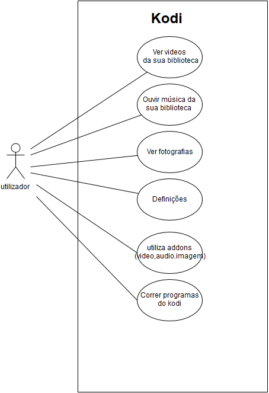

**Contents**

**1. Introduction**

   *1.1 Purpose*
   
   *1.2 Scope*
   
   *1.3 Definitions, acronyms and abbreviations*
   
   *1.4 References*
   
   *1.5 Overview of the remainder of the document*
   
**2. General description**

   *2.1 Product perspective*
   
   *2.2 Product functions*
   
   *2.3 User characteristics*
   
   *2.4 General constraints*
   
   *2.5 Assumptions and dependencies*
   
**3. Specific requirements, covering functional, non-functional and interface requirements**

   *3.1 Requirement X.Y.Z (in Structured Natural Language)*
   
  
**1.Introduction**
        
**1.1 Purpose**
        
O objectivo deste SRS(Software Requirements Specification) é de identificar os requisitos para o projecto de devenvolvimento do Kodi.
        
**1.2 Scope**
        
Este projecto pretende desenvolver um software que permita a reprodução e organização de media(vídeo,áudio e fotografia). O software terá ainda que ser aberto a modificações(plugins ou addons) que permitam a expansão de funcionalidades, por exemplo reprodução de streams,etc.
O código utilizado no projecto é open-source.
        
**1.3 Definitions, acronyms and abbreviations**

GDD - gestão de direitos digitais
        
**1.4 References**

Kodi wiki: http://kodi.wiki/
        
**1.5 Overview of the remainder of the document**
        
O resto deste documento irá analisar em detalhe as principais funcionalidades do Kodi.
        
**2. General description**
        
**2.1 Product perspective**
            
Reproduzir e organizar conteúdo media.
            
**2.2 Product functions**
            
Ter a habilidade de facilmente reproduzir media, através de uma interface simples e intuitiva. Ter também a capacidade de fazer download, instalar e utilizar addons externos, estejam estes no repositório oficial ou noutro qualquer. O software pode ser utilizado em vários sistemas operativos(Windows,iOS,Android,Linux e MacOS).
            
**2.3 User characteristics**
        
O utilizador deverá ter um conhecimento básico de utilização de software. Não é necessário conhecimentos avançados na área de informática.
            Existe um suporte para várias línguas, fusos horários e outras diferenças entre regiões.
            
**2.4 General constraints**
            
Não consegue reproduzir ficheiros de áudio e vídeo que estejam protegidos/encriptados com tecnologias GDD (gestão de direitos digitais) o que significa que,por exemplo ficheiros de áudio comprados no ITunes só podem ser reproduzidos usando outro leitor que suporta GDD ou então remover a proteção do ficheiro.

**2.5 Assumptions and dependencies**

Kodi precisa de um controlador GPU gráfico capaz de 3D para toda a renderização. Os chips GPU 3D necessários são comuns hoje em dia na maioria dos computadores modernos, e mesmo alguns set-top boxes. Kodi funciona bem em que (por padrões Intel Atom) são relativamente fraca potência OpenGL 1.3 (com suporte GLSL), OpenGL ES 2.0 ou Direct3D (DirectX) 9,0 sistemas capazes que estão IA-32 / x86, x86-64, ou CPU ARM baseado.

**3. Specific requirements, covering functional, non-functional and interface requirements**

**3.1 Requirement X.Y.Z (in Structured Natural Language)**

