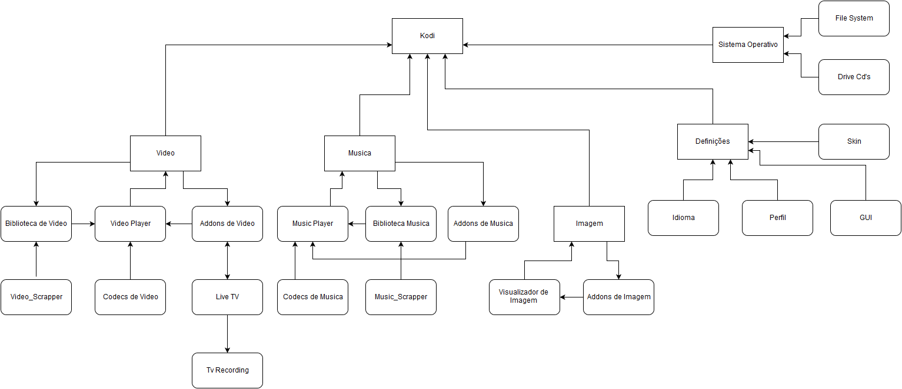

# Arquitecture 4+1

## Visão dos Casos de Uso

Kodi media player,representado nesta imagem mostrando o interior das funcionalidades, com o interface gráfico e principais interações e a interação entre elas.

## Visão Lógica

A imagem representa o modelo simples das funcionalidades do kodi, apresentando a interação entre os dispositivos.

Leitores: parte do kodi que lê e abre os ficheiros. Esta é umas das funcionalidades mais usadas, servindo-se de codecs e bibliotecas partilhadas.
Bibliotecas: onde se guarda o contêudo de entertenimento.
Tv: Tv ao vivo é tambem uma das funcionalidades mais usadas.

## Visão do Processo

Nesta visão podemos perceber como os vários processos do Kodi interagem entre eles, em tempo de execução. Como podemos ver a maioria dos processos de Video,Imagem e Musica alimentam o player respectivo. É possivel ainda perceber a interação que o Kodi tem com o sistema operativo.

## Visão de Implementação

O Kodi tem como objetivo trabalhar com módulos de software independentes uns dos outros, como está dito na sua página Web, “kodi should still compile and run if a non essential module/library is disabled or removed”.
Este tipo de implementação é óptimo para um projeto open-source uma vez que permite um crescimento eficiente do software.

Na figura podemos começar por ver o módulo “Player Core” onde é incluído a forma de ler e apresentar ficheiros de áudio e vídeo com uso de codecs como DIVX e AC3. Estes codecs são necessários para converter a data “crua” numa imagem clara no monitor do utilizador. Em suma, este módulo realiza todas as tarefas relacionadas com a exibição do conteúdo do utilizador. No entanto, estes codecs são desenvolvidos por terceiros e importados por bibliotecas externas.

Em segundo, o módulo “Content Managment” é composto por todos os ficheiros, funções e pacotes que tratam do conteúdo em relação à multimédia. Este módulo trabalha no lado mais “físico” dos ficheiros: armazenamento, localização de ficheiros do disco rigído  e DVDs, transmissão de ficheiros a partir de um servidor externo, entre outros. Permite também encontrar multimédia por etiquetas(tags).

De seguida, o módulo “Interfaces” é integrado por todos os ficheiros e pacotes relacionados, entre outros, com “add-ons”, “streaming clients”, servidores e bibliotecas exteriores. Neste caso, é possível visualizar como é que o resto do sistema continua a trabalhar enquanto um “add-on” não está a funcionar corretamente. Como os “add-ons” são criados por criadores externos é mais provável a ocorrência de erros uma vez que os mesmos têm menos conhecimento acerca do sistema.

Passando agora para o módulo das “skins”, que é o módulo mais popular para criadores externos, é onde se encontram os ficheiros associados às translações, tipos de letra e aspeto do software.

Por último, temos o módulo “fire sharing” que se especializa na partilha de ficheiros. Este módulo está relaciona com “add-ons” relacionados com “download”, “streaming” e partilha. Um exemplo disto são os fornecedores baseados em FTP que publicam filmes, áudio e software próprio para “download” a rápida velocidade.

